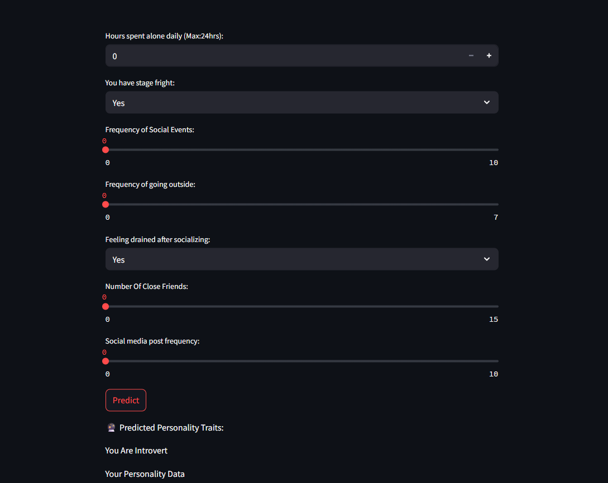

# 🧠 Introvert vs Extrovert Prediction App
[](https://introvert-and-extrovert.streamlit.app/)
[](https://github.com/Git-Suraj-hub/Introvert-And-Extrovert.git)

This project is a simple web application that predicts whether a person is an **Introvert** or an **Extrovert** based on 7 psychological and behavioral traits. The prediction model is powered by the **Perceptron algorithm**, and the web interface is built using **Streamlit**.

## 🚀 Features

- Input-based personality prediction using:
  - Time spent alone
  - Stage fear (numerical score)
  - Social event attendance
  - Frequency of going outside
  - Drained feeling after socializing (numerical score)
  - Size of friend circle
  - Social media post frequency
- Real-time prediction result: **Introvert** or **Extrovert**
- Simple and interactive UI built with Streamlit

## 📊 Input Features

| Feature                        | Description                                                |
|-------------------------------|------------------------------------------------------------|
| `time_spent_alone`            | Hours a person enjoys being alone daily                    |
| `Stage_Fear_numeric`          | Numeric value indicating stage fear     |
| `Social_event_attendance`     | Frequency of attending social events                       |
| `Going_outside`               | Number of times the person goes out per week               |
| `Drained_after_socializing_numeric` | Level of mental exhaustion after socializing  |
| `Friends_circle_size`         | Approximate number of close friends                        |
| `Post_frequency`              | Frequency of social media posts per week                   |

## 🧠 Model Used

- **Perceptron Algorithm**: A basic yet powerful binary classifier used for linearly separable data.
- The model is trained to classify input data into:
  - `0` → Introvert  
  - `1` → Extrovert

## 🛠️ Tech Stack

- **Python** 🐍
- **Streamlit** 🌐 (for UI)
- **scikit-learn** 🤖 (for Perceptron implementation)
- **pandas** & **numpy** (for data handling)

## 📦 How to Run the App

### 1. Clone the repository

```bash
git clone https://github.com/Git-Suraj-hub/Introvert-And-Extrovert.git
cd introvert-extrovert-predictor
```

### 2. Install dependencies

```bash
pip install -r requirements.txt
```

### 3. Run the Streamlit app

```bash
streamlit run app.py
```

## 🧪 Example Output

Once the user fills in the form and clicks **Predict**, the app will output:
```
You Are Introvert.
```
or
```
You Are Extrovert.


```

## 📸 Screenshots



## 📁 File Structure

```
introvert-extrovert-predictor/
│
├── app.py                    # Streamlit app
├── personality_dataset.csv   # Personality Dataset
├── perceptron_model.pkl      # Perceptron Model
└── README.md                 # Project overview (this file)
├── requirements.txt          # Python dependencies
└── Screenshot.png            # Screenshot Of My Ui
```

## 🙌 Acknowledgments

This project was created as a fun and educational demonstration of using classic ML models like Perceptron in modern web apps.

---
## 📄 License

This project is licensed under the MIT License. See [LICENSE](LICENSE) for details.

---

## 📫 Contact

Created by **Suraj**. For questions or feedback, reach out at `suraj773714@gmail.com`.


🧩 *Note: This is a basic predictive tool for educational use only and not a replacement for psychological assessment.*
